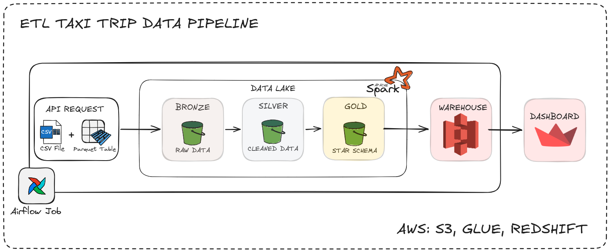
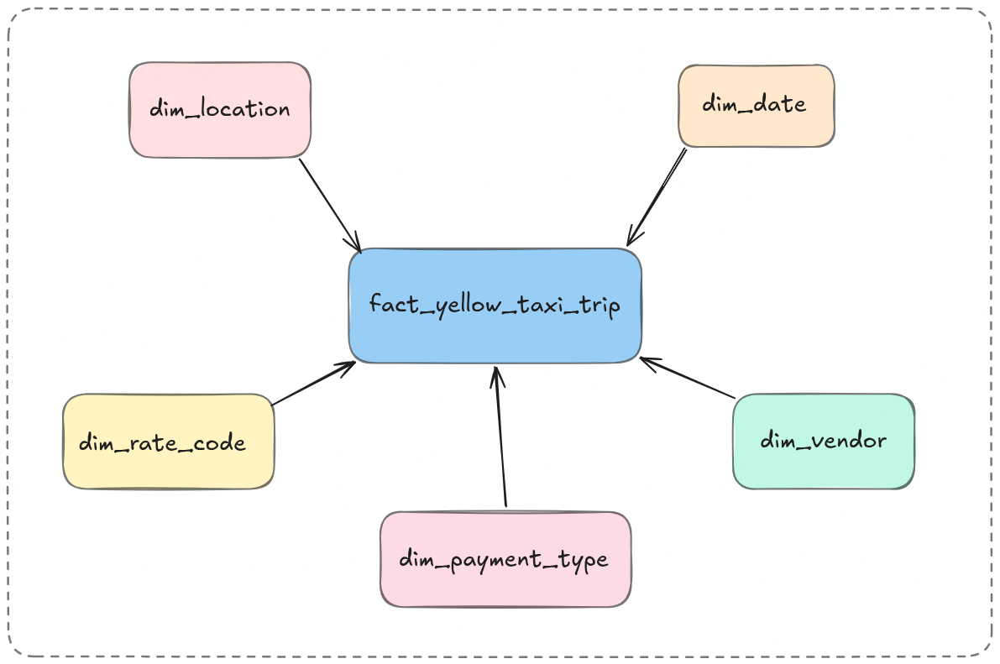
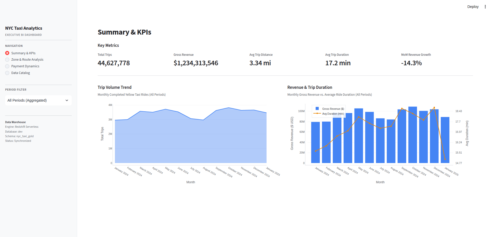

# NYC Yellow Taxi End-to-End Cloud Data Pipeline

### Production-Grade Medallion Architecture & Kimball Star Schema on AWS

[](https://www.python.org/downloads/)
[](https://airflow.apache.org/)
[-E25A1C.svg>)](https://aws.amazon.com/glue/)
[](https://aws.amazon.com/redshift/)
[](https://github.com/astral-sh/uv)
[](https://github.com/astral-sh/ruff)

---

## 📌 Executive Summary

Proyek ini adalah implementasi pipeline data _production-grade_ berskala enterprise yang mengonsumsi **jutaan data transaksi NYC Yellow Taxi** dari sumber publik (NYC TLC), membersihkan dan memvalidasi data menggunakan **Apache Spark 4.1 di AWS Glue 6.0**, dan memodelkannya ke dalam **Kimball Star Schema di Amazon Redshift Serverless**.

Seluruh siklus hidup pipeline diorkestrasi secara otomatis oleh **Apache Airflow**, dirancang dengan prinsip **100% Idempotent** (aman dijalankan ulang tanpa data duplikat), serta dilengkapi **Quality Gate Circuit Breaker** untuk mencegah masuknya data anomali ke data warehouse.

> **Key Metrics:**
>
> - **Dataset Skala Penuh:** Telah diuji memproses multi-partisi lintas tahun (`2024-01`, `2024-02`, dan `2025-01`) dengan total **>8,8 juta baris data**.
> - **SLA Pipeline:** Eksekusi end-to-end per partisi bulanan selesai dalam kurun waktu **~4 menit 20 detik** (dari download, Glue Spark cleaning, quality gate, Glue Spark gold modeling, hingga Redshift `COPY`).
> - **Data Quality:** Menegakkan _Zero-NULL Policy_ pada metrik finansial dan kunci dimensi, serta mengisolasi anomali sensor taksi secara empiris.

---

## 🏗️ Arsitektur Sistem (Medallion Architecture)

<figure align="center">
  
  <figcaption>Gambar 1. Arsitektur ETL Taxi Trip Data Pipeline</figcaption>
</figure>

---

## 📐 Data Modeling: Kimball Star Schema

Deliverable utama dirancang untuk melayani query analitik ad-hoc dan reporting BI dengan latensi rendah.

<figure align="center">
  
  <figcaption>Gambar 2. Star Schema</figcaption>
</figure>

### Karakteristik Model Data:

- **Fact Table Grain:** Tepat satu baris merepresentasikan **satu perjalanan Yellow Taxi valid**.
- **Role-Playing Dimension:** `dim_date` berperan ganda sebagai dimensi waktu penjemputan (`pickup_date_key`) dan penurunan (`dropoff_date_key`).
- **Unknown Key (`Key = 0`) Protection:** Seluruh dimensi memiliki baris bootstrap `Key = 0` (`Unknown`). Jika terjadi anomali kode transaksi di lapangan, data fakta tetap termuat tanpa merusak integritas relasional data warehouse.
- **SCD Strategy:**
  - `dim_date`: **SCD Type 0** (Statis, pre-generated 2020–2030).
  - `dim_location`, `dim_vendor`, `dim_rate_code`, `dim_payment_type`: **SCD Type 1** (Overwrite).

---

## 💡 Engineering Challenges & Technical Insights

Berikut adalah beberapa keputusan desain dan _debugging insights_ nyata yang diselesaikan selama membangun sistem ini:

### 1. Perangkap `IDENTITY(1, 1)` pada Distributed MPP Redshift

- **Masalah:** Saat pertama kali memuat data dimensi lokasi (`dim_location`) menggunakan `IDENTITY(1, 1)`, hasil query `JOIN` di tabel fakta menghasilkan `loc.borough = NULL` dan `loc.zone = NULL` untuk 99.9% data perjalanan.
- **Akar Masalah:** Di arsitektur terdistribusi Redshift, generator `IDENTITY` mengalokasikan nomor urut per-_compute slice_ dalam blok terpisah (misal: 1..1000, 1001..2000, dst.), bukan urut kontigu 1, 2, 3.. 265. Akibatnya, `location_key` acak dan tidak cocok dengan `pu_location_id` asli dari argo taksi.
- **Solusi:**
  - Untuk **Tabel Dimensi Parent**: Gunakan _Deterministic Natural Integer Key_ (`location_key = location_id`).
  - Untuk **Tabel Fakta (`trip_key`)**: Tetap gunakan `BIGINT IDENTITY(1, 1)` karena fungsinya murni sebagai surrogate ID baris transaksi dan tidak pernah dijadikan target rujukan foreign key oleh tabel lain.

### 2. Keterbatasan Format Parquet pada Redshift `COPY` (`xen_copy_spectrum`)

- **Masalah:** Perintah `COPY` dari Parquet melempar error: `ERROR: DEFAULT columns are currently unsupported for this format if not included in the column list (context: inserted_at_utc)`.
- **Akar Masalah:** Berbeda dengan CSV, pembacaan binary Parquet di Redshift tidak mengevaluasi ekspresi SQL skalar dinamis (`DEFAULT GETDATE()`) untuk kolom yang tidak terdapat di file Parquet.
- **Solusi:** Memindahkan pembentukan timestamp audit ke engine komputasi hulu di PySpark:
  ```python
  F.current_timestamp().alias("inserted_at_utc")
  ```
  Ini memberikan manfaat ganda: mengatasi error Redshift sekaligus mencatat audit lineage waktu pemrosesan Spark yang presisi.

### 3. Jaminan 100% Idempotency (Scoped Partition Replace)

- **Masalah:** Perintah `COPY` Redshift secara default melakukan _append_, sehingga menjalankan ulang pipeline untuk bulan yang sama berisiko menduplikasi data transaksi.
- **Solusi:** Mengimplementasikan pola **Atomic Partition Replacement**:

  ```sql
  DELETE FROM nyc_taxi_gold.fact_yellow_taxi_trip
  WHERE source_year = {year} AND source_month = {month};

  COPY nyc_taxi_gold.fact_yellow_taxi_trip (...)
  FROM 's3://.../fact_yellow_taxi_trip/year=YYYY/month=MM/'
  IAM_ROLE default FORMAT AS PARQUET;
  ```

  Menjalankan ulang partisi bulan yang sama 1 kali atau 100 kali menghasilkan data yang identik tanpa menyenggol partisi bulan/tahun lain.

### 4. Graceful Skipping pada Data Masa Depan (`AirflowSkipException`)

- **Masalah:** Penjadwalan otomatis bulanan (`@monthly`) dapat memicu eksekusi untuk periode data yang belum dirilis oleh NYC TLC (menghasilkan HTTP 403/404 dari CloudFront).
- **Solusi:** Menangkap status HTTP 403/404 dan melempar `AirflowSkipException`. Task unduhan dan seluruh task Glue/Redshift di bawahnya otomatis berubah status menjadi **Skipped** secara anggun (_graceful skip_) tanpa membuat alert panik dan tanpa membuang biaya komputasi AWS.

---

## 📊 Business Acceptance Queries & Insights

<figure align="center">
  
  <figcaption>Gambar 3. Dashboard BI Streamlit</figcaption>
</figure>

Berikut adalah verifikasi hasil query analitik nyata yang dieksekusi di Amazon Redshift Serverless:

```sql
SET search_path TO nyc_taxi_gold;

-- 1. Rekapitulasi Volume Perjalanan & Pendapatan Lintas Bulan
SELECT
    d.year,
    d.month_name,
    COUNT(f.trip_key) AS total_trips,
    ROUND(SUM(f.total_amount), 2) AS total_revenue_usd,
    ROUND(AVG(f.trip_distance), 2) AS avg_distance_miles,
    ROUND(AVG(f.trip_duration_seconds / 60.0), 2) AS avg_duration_minutes
FROM fact_yellow_taxi_trip AS f
LEFT JOIN dim_date AS d ON f.pickup_date_key = d.date_key
GROUP BY d.year, d.month_name, f.source_year, f.source_month
ORDER BY f.source_year, f.source_month;
```

### Hasil Empiris Nyata:

- **Volume Januari 2024:** 2.963.711 perjalanan valid, menghasilkan **\$79,41 Juta USD** (durasi rata-rata: 15,6 menit, jarak rata-rata: 3,23 mil).
- **Top Revenue Zone:** **Queens — JFK Airport** (145.183 trip) menghasilkan revenue tertinggi sebesar **\$11,11 Juta USD** karena kombinasi flat-rate tarif bandara, biaya tol, dan durasi perjalanan jauh.
- **Pola Tip Realistis:** Transaksi _Credit Card_ menghasilkan rata-rata tip **\$4,16** (~15–20% dari total tagihan), sedangkan transaksi _Cash_ tercatat **\$0,00** (tip tunai diterima langsung oleh pengemudi di luar sistem argo).

---

## 📁 Struktur Direktori Repository

```text
.
├── airflow-nyc-taxi/               # Environment Airflow Lokal (Standar Docker Compose)
│   ├── dags/
│   │   └── nyc_taxi_pipeline.py    # DAG Otomasi End-to-End & Idempotent
│   ├── docker-compose.yaml
│   └── .env
├── jobs/                           # Standalone PySpark Scripts untuk AWS Glue
│   ├── silver_job.py               # Pembersihan, filtering, & audit report
│   └── gold_job.py                 # Transformasi dimensi & fact star schema
├── notebooks/                      # Exploratory Data Analysis (EDA)
│   └── 01_eda_bronze_to_silver.ipynb # Analisis empiris 2.96 juta record raw
├── nyc_taxi_etl/                   # Package Python Modular (Core Logic)
│   ├── bronze/                     # Streaming download, SHA-256 manifest
│   ├── silver/                     # Standarisasi kolom, validasi fisik, null handling
│   ├── gold/                       # Logika pembentukan dimensi & fakta Kimball
│   └── warehouse/                  # Redshift Data API loader & query runner
├── sql/
│   └── redshift/                   # DDL & Query Acceptance Test
│       ├── 001_create_schema.sql
│       ├── 002_create_dimensions.sql
│       ├── 003_create_fact.sql
│       ├── 004_load_gold_data.sql
│       └── validation_queries.sql
├── tests/                          # Automated Testing Suite
│   ├── unit/
│   │   ├── test_config.py
│   │   ├── test_bronze.py
│   │   ├── test_silver.py
│   │   └── test_gold.py
├── docs/
│   └── plan.md                     # Technical roadmap & debugging knowledge base
├── pyproject.toml                  # Manajemen dependensi modern via uv
├── uv.lock
└── README.md
```

---

## 🚀 Panduan Menjalankan Proyek (Quickstart)

### 1. Prasyarat Sistem

- Python 3.11+ dan [`uv`](https://docs.astral.sh/uv/)
- Docker & Docker Compose
- Akun AWS aktif dengan konfigurasi profil AWS CLI (`~/.aws/credentials`)

### 2. Setup Virtual Environment & Unit Testing

```bash
# Clone repository
git clone https://github.com/[YOUR_GITHUB_USERNAME]/[YOUR_REPO_NAME].git
cd [YOUR_REPO_NAME]

# Install dependensi dan jalankan linter
uv sync
uv run ruff check .

# Jalankan seluruh automated unit tests (PySpark Local Fixtures)
uv run pytest -v
```

### 3. Deploy Artifact ke AWS S3

```bash
# Package modular Python library untuk AWS Glue
zip -r nyc_taxi_etl.zip nyc_taxi_etl -x "*/__pycache__/*"
aws s3 cp nyc_taxi_etl.zip s3://[YOUR_BUCKET_NAME]/packages/nyc_taxi_etl.zip

# Upload script Glue
aws s3 cp jobs/silver_job.py s3://[YOUR_BUCKET_NAME]/scripts/silver_job.py
aws s3 cp jobs/gold_job.py s3://[YOUR_BUCKET_NAME]/scripts/gold_job.py
```

### 4. Menjalankan Airflow Orchestrator

```bash
cd airflow-nyc-taxi

# Konfigurasi .env (sesuaikan UID linux)
echo -e "AIRFLOW_UID=$(id -u)\nCOMPOSE_PROJECT_NAME=nyc-taxi-aws-project-airflow" >> .env

# Inisialisasi dan nyalakan container
docker compose run --rm airflow-init
docker compose up -d
```

Akses UI Airflow di `http://localhost:8080` (user: `airflow`, pass: `airflow`), konfigurasikan koneksi `aws_default`, lalu trigger DAG `nyc_taxi_end_to_end_pipeline`!

---

## 👤 Author & Contact

- **Nama:** Ikhsannudin Lathief
- **LinkedIn:** [www.linkedin.com/in/ikhsannudin-lathief/](https://www.linkedin.com/in/ikhsannudin-lathief/)

> _"Building reliable, cost-effective, and fault-tolerant data pipelines through defensive engineering and sound dimensional modeling."_
